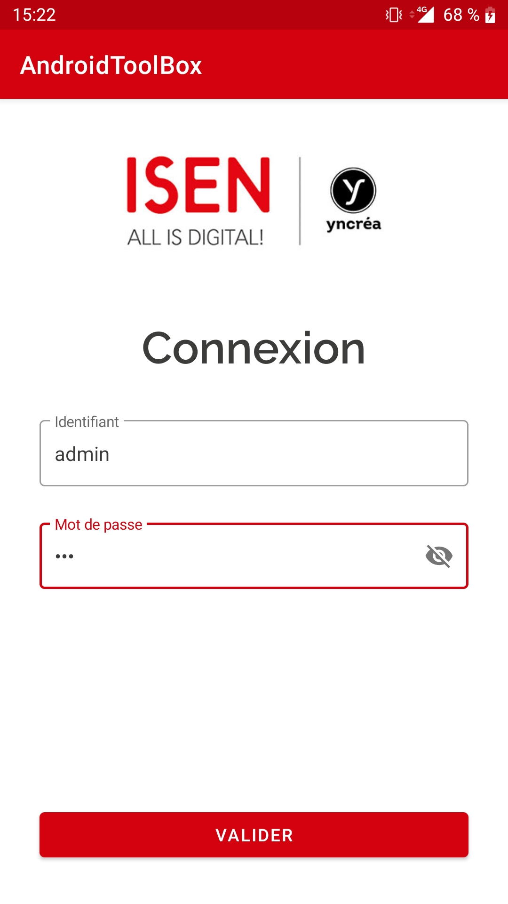
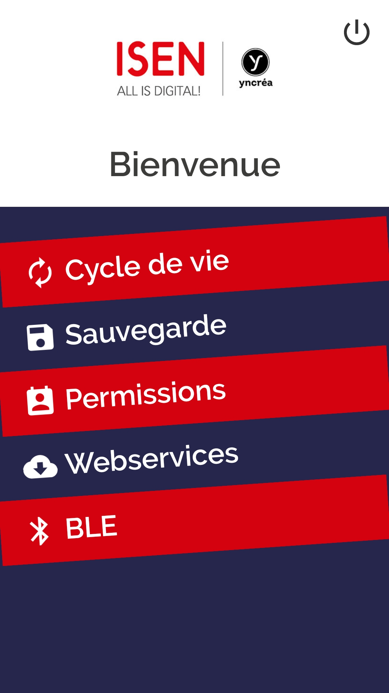
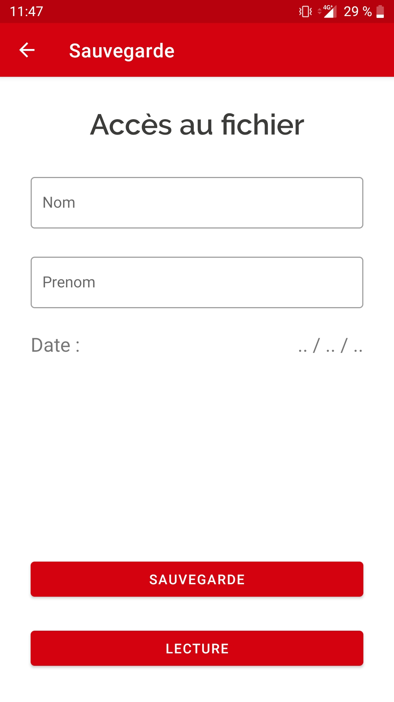
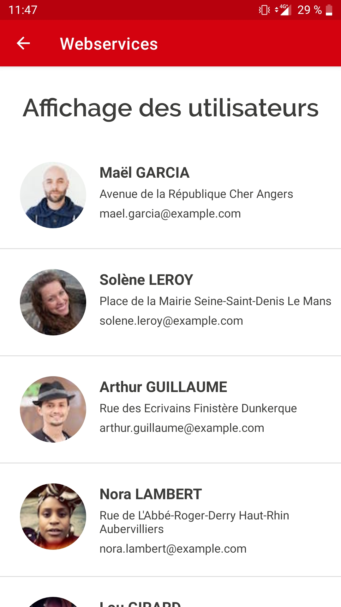

# AndroidKtnToolBox

Ce projet est une application support au cours de développement mobile enseigné à l'ISEN Toulon.
Il permet notamment de comprendre les concepts de :

- Layout / Activité
- Cycle de vie de l'activité
- Système de sauvegarde Android
- Permission pour utiliser les fonctions sensibles du smartphone
- Appel à une api via les webservices
- Utilisation du BLE

 

  
  
  
  

